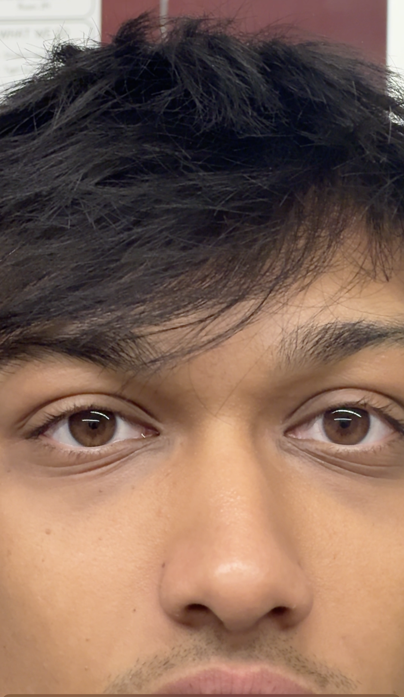
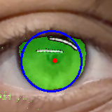
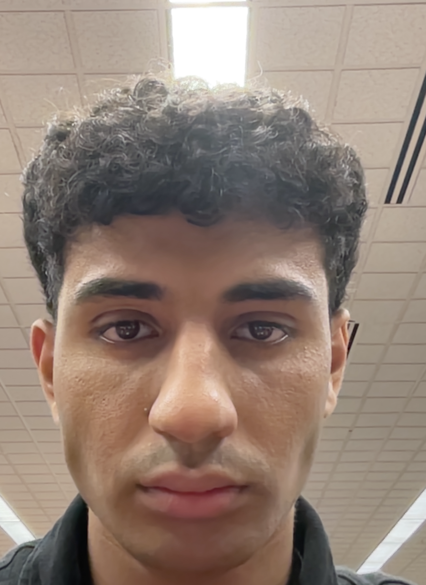
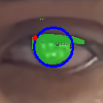

# EyesPy: Iris Segmentation

EyesPy is an advanced iris segmentation and measurement tool that utilizes computer vision and AI techniques to accurately detect, segment, and measure the iris from eye images.

## Overview

The iris is a crucial biometric feature with applications in identity verification, medical diagnosis, and research. EyesPy provides tools to:

1. Detect eyes in images (both full-face and close-up)
2. Precisely segment the iris using Segment Anything Model (SAM)
3. Measure iris diameter in both pixels and estimated millimeters
4. Visualize the detection results

## Features

- **Robust Eye Detection**: Works with both full-face images and close-up eye photos
- **Advanced Iris Segmentation**: Uses SAM (Segment Anything Model) with optimized prompts
- **Multi-approach Pipeline**: Falls back to traditional computer vision methods when needed
- **Dimension Estimation**: Converts pixel measurements to physical dimensions
- **Interactive Mode**: Manual eye selection for difficult cases

## Examples

### Example 1: Iris Segmentation

**Input Image:**



**Result with Iris Detection:**



### Example 2: Close-up Iris Detection

**Input Image:**



**Result with Iris Detection:**



## How It Works

The iris segmentation pipeline follows these steps:

1. **Eye Detection**:
   - Uses dlib's facial landmark detection for full-face images
   - Provides options for manual eye selection when facial landmarks fail
   - Automatically splits close-up images containing both eyes

2. **Preprocessing**:
   - Applies contrast enhancement with CLAHE
   - Uses adaptive thresholding to improve detection in varying lighting conditions

3. **Iris Segmentation**:
   - Primary method: SAM (Segment Anything Model) with point and box prompts
   - Identifies the darkest region in the eye as the iris center
   - Scores mask candidates based on darkness, circularity, and position

4. **Fallback Methods**:
   - Hough Circle Transform
   - Dark blob detection
   - Contour analysis

5. **Measurement and Analysis**:
   - Calculates iris diameter in pixels
   - Estimates real-world measurements in millimeters
   - Provides visualization of detected iris boundaries

## Requirements

- Python 3.8+
- OpenCV
- dlib
- PyTorch
- Segment Anything Model (SAM)

## Installation

1. Clone the repository:
   ```
   git clone https://github.com/yourusername/EyesPy-MPD.git
   cd EyesPy-MPD
   ```

2. Install dependencies:
   ```
   pip install -r requirements.txt
   ```

3. Download required models:
   - SAM model (`sam_vit_h_4b8939.pth`)
   - dlib shape predictor (`shape_predictor_68_face_landmarks.dat`)

## Usage

```python
from iris_segmentation import IrisSegmentor

# Initialize the segmentor
segmentor = IrisSegmentor()

# Process an image
results = segmentor.process_image("path/to/image.jpg")

# Display results
for eye_key, eye_data in results.items():
    if 'diameter' in eye_data:
        print(f"{eye_key} iris diameter: {eye_data['diameter']:.2f} pixels ({eye_data['diameter_mm']:.2f} mm)")
```

## Command Line Interface

Run the script directly to use the command line interface:

```
python iris_segmentation.py
```

You will be prompted to enter the path to an image file, and the results will be saved to the `mihir_test` directory.

## License

This project is licensed under the MIT License - see the LICENSE file for details.

## Acknowledgments

- Segment Anything Model (SAM) by Meta AI Research
- dlib library for facial landmark detection 